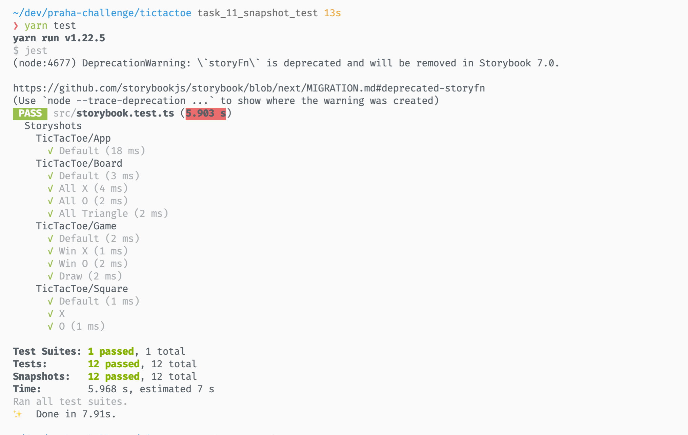

# スナップショットテストを書こう

## 質問

### 1

スナップショットテストとは、あるプログラムの出力をを以前の出力と比較し、差分を確認するテスト。レンダリングエラーやマークアップの変更を検知できる。

[Snapshot testing with Storybook](https://storybook.js.org/docs/react/workflows/snapshot-testing)

### 2

- 防止できる不具合
  - レンダリングエラー
  - 意図しないマークアップの変更
- 防止できない不具合
  - ロジックの不具合
  - スタイルの意図しない変更
  - 状態の変遷中の不具合

## 実装

### 1

スナップショットの情報 (抜粋)

```js
exports[`Storyshots TicTacToe/Square X 1`] = `
<div>
  <style
    dangerouslySetInnerHTML={
      Object {
        "__html": "body{font-family:sans-serif;}",
      }
    }
    data-emotion="css-global 116sk7q"
  />
  <style
    dangerouslySetInnerHTML={
      Object {
        "__html": ".css-1cni0a6{background-color:transparent;cursor:pointer;border:1px solid #999;font-size:24px;font-weight:bold;line-height:34px;height:34px;margin:-1px -1px 0 0;padding:0;text-align:center;width:34px;}.css-1cni0a6:focus{outline:none;}",
      }
    }
    data-emotion="css 1cni0a6"
  />
  <button
    className="css-1cni0a6"
    onClick={[Function]}
  >
    X
  </button>
</div>
`;
```

レンダリング結果のHTMLが文字列として記録されている

### 2

1. 「OとX」のスナップショットテスト



2. 半と丁に変更したため、テストが落ちた


3. スナップショットを更新した


## クイズ

### クイズ1

ユニットテストと比べてスナップショットテストの優れている点は何ですか？

<details><summary>回答例</summary>

- フロントエンドとの相性がいい
- テスト用のコードを特別書かなくていいため導入しやすい
- レンダリング結果のテストができる
- ちょっとした変化でも検知できる

[スナップショットテストのうれしさ - hitode909の日記](https://blog.sushi.money/entry/2020/10/06/234913)
</details>

### クイズ2

反対に、ユニットテストの優れている点は何ですか？

<details><summary>回答例</summary>

- 細かくテストできる
- TDDしやすい
- ドキュメント代わりになる
- 問題箇所の特定がしやすい
- バックエンドとの相性がいい
</details>

### クイズ3

スナップショットファイルはコミットすべきでしょうか？

<details><summary>回答例</summary>

するべき。スナップショットファイルは現在のモジュールの状態を表すものであり、テストの一部であるため。

> スナップショットファイルはコミットする必要がありますか？
>
> はい、スナップショットがカバーするモジュールとテストと共にすべてのスナップショットファイルはコミットされるべきです。 Jestの他のアサーションの値と同様に、スナップショットはテストの一部とみなされるべきです。 実際、スナップショットが指定された時点でのソースモジュールの状態を表すものなのです。 こうしてソースモジュールが変更された場合、Jestは以前のバージョンから変更があったことを見分けられるのです。 コードレビューにおいてレビュアーが加えられた変更をより理解しやすくなるたくさんの追加のコンテクストを提供するものでもあります。

[スナップショットテスト · Jest](https://deltice.github.io/jest/docs/ja/snapshot-testing.html)
</details>
