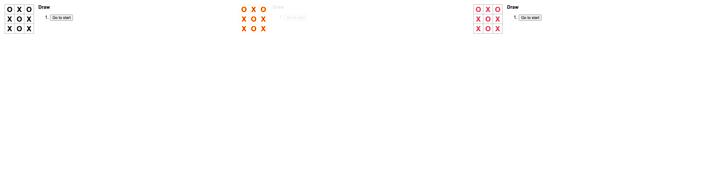
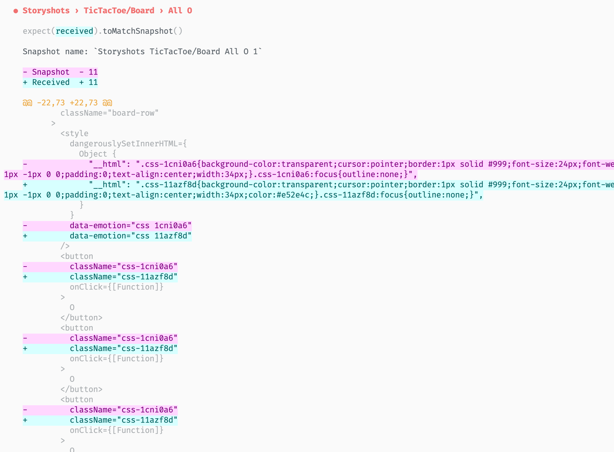
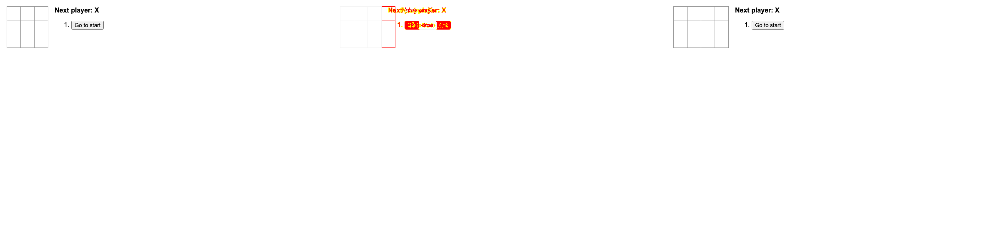
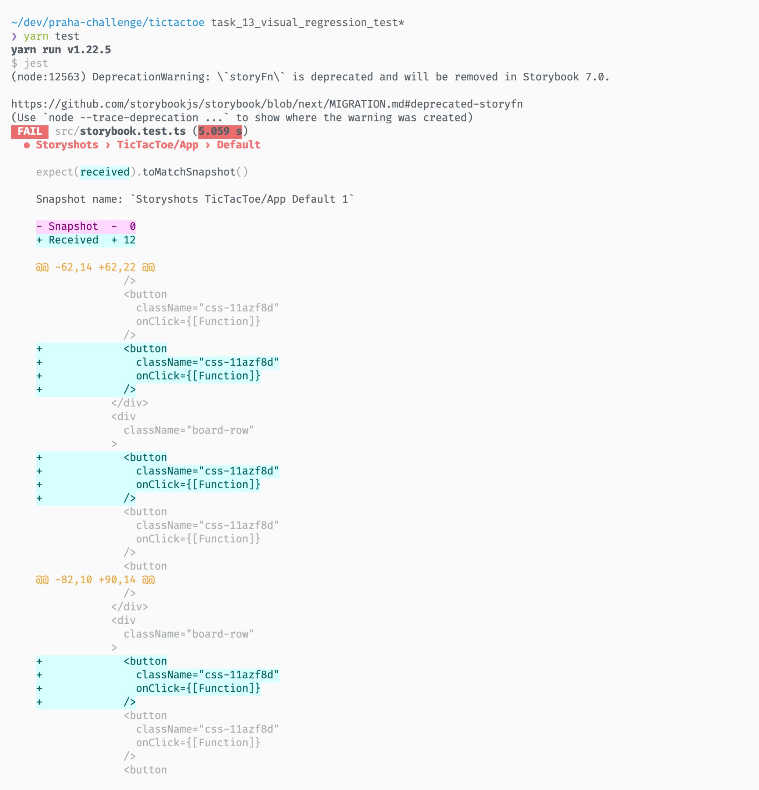

# ビジュアル・リグレッションテストを書こう

## 実装

1. OXを赤色にしたことが検知された

2. snapshotの方でも検知された (CSS-in-JSだから。回避する方法がある？)

3. 3x3 が 4x3 になったことが検知された

4. snapshotの方でも検知された

## 質問

### スナップショットテスト

- メリット
  - フロント向き
  - 手軽
  - DOMの変更が検知できる (alt情報、href情報など)
- デメリット
  - スタイルの変化は検知できない
  - 複雑な変更の場合、変更箇所がわかりづらい

### ビジュアル・リグレッションテスト

- メリット
  - フロント向き
  - スタイルの細かな変更まで検知できる -> CSSのリファクタリングができる
  - 画像までテストできる
  - 視覚的に変更箇所がわかりやすい
- デメリット
  - DOMの内部構造の変化までは検知できない
  - 少しのスタイル調整でもテストが落ちる (良くもあり悪くもあり？)

## クイズ

### クイズ1

スナップショットテストでは検知できないが、ビジュアルリグレッションテストで検知できる不具合にはどのようなものがありますか？

回答例

- スタイルの細かな変化 (色が違う、フォントサイズ、表示されていない)
- 画像やsvgの変化

[1px の変化も見逃さない！ビジュアルリグレッションテスト導入で快適フロントエンド開発 - クラシル開発ブログ](https://tech.dely.jp/entry/vis_reg_test)

### クイズ2

そもそも、リグレッションテストとは何ですか？

回答例

リグレッションテスト (回帰テスト) は、プログラムの変更に伴いソフトウェアに予想外の影響が現れていないかを確認するテスト。

> 回帰テスト (かいきテスト、英: regression testing)とは、前にテストしたソフトウェアが変更後もまだ動作するかどうかを、機能テストと非機能テストを再度実行して確認する作業のこと[1]。退行テスト、リグレッションテストとも呼ばれる。

> ソフトウェアへの変更が非常に頻繁であるアジャイルソフトウェア開発では、回帰テストによって多くの不要なオーバーヘッドが発生する可能性があります[9]。

[回帰テスト - Wikipedia](https://ja.wikipedia.org/wiki/%E5%9B%9E%E5%B8%B0%E3%83%86%E3%82%B9%E3%83%88)

### クイズ3

同じくビジュアルリグレッションテストに使用される storycap と storyshots-puppeteer の違いは何でしょうか？

回答例

storycapはスクリーンショットを撮るだけ。差分の検出はreg-suite等で行う。

reg-suiteは画像の比較結果をHTMLで閲覧することができる。

[くりーむわーかー : StoryBookのVisualTest(StoryShotsとStorycap)](https://cream-worker.blog.jp/archives/1077144612.html)

## その他

- 毎回storybookビルドする必要があるのでテストに時間がかかりそう
- css-in-jsいちいちクラス名変わるからsnapshotでも検知されてしまう
